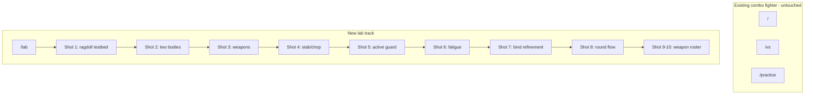

# Conflict Smasher 39,999 — Lab Physics Pivot

## Vision (full roadmap)

This is a **parallel experiment** to the existing combo fighter in [`src/components/stick-fighter-game.tsx`](src/components/stick-fighter-game.tsx) and [`src/lib/stick-fighter/simulation.ts`](src/lib/stick-fighter/simulation.ts). **Do not modify those files or their routes.**

A spacing-and-timing weapon fighter inspired by Hellish Quart / Bushido Blade: real geometric weapons, emergent bind physics, fatigue as a third axis. Stick figures + Matter.js ragdolls replace hand-tuned animation.



| Shot | Scope | Combat? |
|------|-------|---------|
| **1** *(this build)* | One ragdoll, walk, click impulse, collapse/recover | No |
| 2 | Two characters, push each other | No |
| 3 | Weapons as constrained physics bodies, clash | No |
| 4 | Stance + stab/chop phases, hit = round over | Yes |
| 5 | Active guard zone + auto-parry | Yes |
| 6 | Stamina, regen, feint, speed scaling | Yes |
| 7 | Bind dominance, wiggle, press-down | Yes |
| 8 | Best-of-3 round/match UI | Yes |
| 9–10 | Spear, pole hammer, rapier+buckler, select screen | Yes |
| 11+ | Polish, LLM taunts, deploy | — |

Design principles to carry through all shots: spacing over combos, physics over animation, real pixel weapons, emergent binds, fatigue as third axis.

---

## Hard constraints

- **New files only** under `src/app/lab/`, `src/components/lab/`, `src/lib/lab/`
- **One dependency add:** `matter-js` (+ `@types/matter-js` dev)
- Canvas size matches existing game: **720×380** (same as `VIEW_W` / `VIEW_H` in simulation — duplicate constants in lab, do not import from stick-fighter)
- **Fixed 60 Hz** physics step (16.67 ms), same pattern as the combo fighter's accumulator loop
- Matter.js gravity: **positive Y** (down in canvas space)
- No sound, no weapons, no opponent in Shot 1

---

## File layout (Shot 1)

| File | Role |
|------|------|
| [`src/lib/lab/tuning.ts`](src/lib/lab/tuning.ts) | Single source of truth — paste full `TUNING` object from design doc (all constants, even unused in Shot 1) |
| [`src/lib/lab/constants.ts`](src/lib/lab/constants.ts) | `VIEW_W`, `VIEW_H`, `FLOOR_Y`, `TICK_RATE`, `TICK_MS`, line widths, body segment lengths |
| [`src/lib/lab/collision-groups.ts`](src/lib/lab/collision-groups.ts) | Matter.js `category` / `mask` / `group` for per-character no-self-collision |
| [`src/lib/lab/ragdoll.ts`](src/lib/lab/ragdoll.ts) | Build stick figure: bodies + revolute constraints; export part IDs and lookup |
| [`src/lib/lab/upright-control.ts`](src/lib/lab/upright-control.ts) | PD torque on torso toward vertical; strength multiplier 0–1 for recovery ramp |
| [`src/lib/lab/world.ts`](src/lib/lab/world.ts) | `Engine.create`, static ground, `stepWorld(engine, dt)` |
| [`src/lib/lab/render.ts`](src/lib/lab/render.ts) | Draw ground + stick segments from body positions/angles (black lines, ~2.5–3.5px) |
| [`src/lib/lab/types.ts`](src/lib/lab/types.ts) | `CharacterState`, body part enums, ragdoll handle type |
| [`src/components/lab/physics-testbed.tsx`](src/components/lab/physics-testbed.tsx) | Client component: canvas, rAF loop, keyboard/mouse input, debug HUD |
| [`src/app/lab/page.tsx`](src/app/lab/page.tsx) | Server page — metadata + mounts `PhysicsTestbed` in a simple layout |

Optional thin wrapper: [`src/components/lab/lab-shell.tsx`](src/components/lab/lab-shell.tsx) — minimal page chrome with “← Back” link (new component; do not reuse or edit `stick-fighter-shell.tsx`).

---

## Ragdoll rig (Matter.js)

**13 dynamic bodies** connected by **revolute constraints** (pin joints):

```
        [head]
          |
       [torso]  ← upright torque applied here
      /   |   \
 [uArmL] [uArmR]
    |       |
 [lArmL] [lArmR]
    |       |
 [handL] [handR]

 [uLegL] [uLegR]
    |       |
 [lLegL] [lLegR]
    |       |
 [footL] [footR]
```

**Segment sizing (starting guesses in `constants.ts`):**

- Torso: ~24×56 px rectangle, center of mass at hip height
- Head: ~18 px circle on neck constraint
- Limbs: upper ~28 px, lower ~26 px, hands/feet small circles or short rects
- Feet rest on `FLOOR_Y` (~336, matching existing `VIEW_H - 44`)

**Collision filters:**

- Each character gets a unique `group: -1` (same group skips mutual collision)
- Ground is static, collides with all character parts
- Character parts collide with ground only (Shot 1 — no inter-character yet)

**Constraints:**

- Anchor points at joint ends (shoulder → elbow → wrist, hip → knee → ankle)
- `stiffness: 0.9–1.0`, `damping: 0.1` — loose enough to wobble, stiff enough to stay connected
- No motors in Shot 1

---

## Upright balance (magnetic hack)

Apply each physics tick in [`upright-control.ts`](src/lib/lab/upright-control.ts):

```typescript
// PD-style angular correction on torso
const angleError = -torso.angle; // target = 0 (upright)
const av = torso.angularVelocity;
const torque = angleError * TUNING.TORSO_UPRIGHT_TORQUE - av * TUNING.TORSO_UPRIGHT_DAMPING;
Matter.Body.setAngularVelocity(torso, av + torque); // or applyForce at offset
```

Multiply torque by `uprightStrength` (0–1):

| State | `uprightStrength` | Duration |
|-------|-------------------|----------|
| `active` | 1.0 | default |
| `stunned` | 0.0 | 1000 ms (`KNOCKDOWN_DURATION_MS`) after Space |
| `recovering` | 0 → 1 linear | 2000 ms (`RECOVERY_DURATION_MS`) |

**Spacebar flow:**

1. On keydown: set state `stunned`, `uprightStrength = 0`, start timer
2. After 1 s: state `recovering`, ramp strength 0→1 over 2 s
3. After ramp complete: state `active`

Total collapse-to-standing: ~3 s — matches acceptance criteria.

---

## Input and game loop

**In [`physics-testbed.tsx`](src/components/lab/physics-testbed.tsx):**

| Input | Action |
|-------|--------|
| ← / → | Horizontal force on torso (`TUNING.WALK_FORCE`) while held |
| Space | Trigger collapse / recovery cycle (ignore repeat while stunned) |
| Mouse click | Find nearest body part to click (canvas coords → world coords); apply impulse toward click point |

**rAF loop** (mirror combo fighter pattern):

1. Accumulate elapsed ms, cap with `MAX_STEPS_PER_FRAME = 5`
2. While accumulator ≥ `TICK_MS`: apply upright torque → apply walk force → `Engine.update(engine, TICK_MS)` (or fixed step)
3. Render every frame regardless of sim steps
4. Track FPS with rolling average for HUD

**Focus:** canvas tabIndex + keydown on window; show hint text “Click canvas to focus”

---

## Rendering

[`render.ts`](src/lib/lab/render.ts):

- Simple background: flat sky gradient or solid fill + ground line at `FLOOR_Y` (match existing aesthetic — minimal, not copying mountain parallax from combo fighter)
- Draw each limb as a line segment between constraint anchor world positions, or rotated rect outline from `body.bounds`
- Line width 2.5–3.5 px, stroke `#111` or similar
- **No pose overlay** — pure physics positions

---

## Debug HUD (corner overlay)

DOM div over canvas (not canvas text — easier to read):

- **State:** `active` | `stunned` | `recovering`
- **Torso angle** (degrees) and **angular velocity**
- **FPS** (rolling 30-frame average)
- **Controls reminder:** arrows walk, space collapse, click impulse

---

## Tuning file

[`src/lib/lab/tuning.ts`](src/lib/lab/tuning.ts) — copy the full `TUNING` export from the design doc verbatim. Shot 1 only reads:

- `TORSO_UPRIGHT_TORQUE`, `TORSO_UPRIGHT_DAMPING`
- `WALK_FORCE`, `WALK_FORCE_EXHAUSTED` *(exhausted unused until Shot 6)*
- `KNOCKDOWN_DURATION_MS`, `RECOVERY_DURATION_MS`

Unused keys stay in place for later shots — one source of truth.

---

## Dependency install

```bash
npm install matter-js
npm install -D @types/matter-js
```

Import Matter only in client modules (`"use client"`). No SSR issues if physics runs inside `useEffect`.

---

## Acceptance criteria (Shot 1)

1. Character stands upright stably with no input (may wobble slightly — that's fine)
2. Arrow keys walk left/right; limbs flop naturally
3. Mouse click on a body part applies impulse; character stumbles or falls realistically
4. Spacebar causes immediate collapse (upright torque off)
5. After ~3 s total, character struggles back to standing
6. `/lab` loads without touching existing routes; `npm run build` passes

---

## Verification

1. `npm run lint`
2. `npm run build`
3. Manual at `http://localhost:3000/lab`:
   - Idle stability (10 s)
   - Walk both directions
   - Click torso, head, leg — ragdoll response
   - Space → collapse → recovery ramp
   - HUD updates correctly

---

## Explicitly NOT in Shot 1

- Weapons, combat, stamina, guard, binds
- Second character
- Links from main menu (navigate to `/lab` manually — avoids editing existing pages)
- Changes to [`PLAN.md`](PLAN.md) combo-fighter phases (optional: add a separate **Lab log** section later if Kyle wants unified tracking)
- Realistic biped balance — magnetic upright only

---

## Future shots (reference only — do not build yet)

**Shot 2:** second ragdoll + P2 keys; inter-body collision between characters.

**Shot 3:** weapon body constrained to hand with slack; weapon-weapon collision.

**Shot 4–7:** stab/chop phase machine, guard zone, fatigue, bind tuning per design doc weapon table.

**Weapon roster** (Shots 9–10):

| Weapon | Length | Width | Mass | Friction |
|--------|--------|-------|------|----------|
| Spear | 200 | 3 | 2 | 1 |
| Pole Hammer | 180 | 12 | 8 | 9 |
| Long Sword | 110 | 5 | 5 | 5 |
| Rapier + Buckler | 80 | 2 | 3 | 4 |

Bind friction formula: `(weaponA.friction + weaponB.friction) / 2`.
