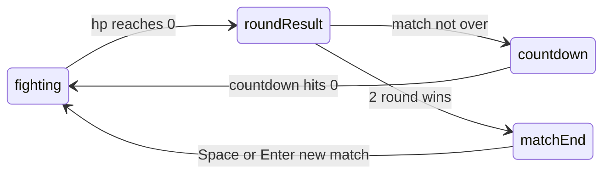

# Phase 1 — Round flow

## What you confirmed (grill-me)

| Decision | Choice |
|----------|--------|
| Match format | Fixed **best-of-3** (first to 2 round wins) |
| Between rounds | **3-2-1 countdown**, then auto-start |
| Match state | **Component layer** in [`stick-fighter-game.tsx`](src/components/stick-fighter-game.tsx) for v1 |

**Additional default** (not asked — say if you want different): **weapon choice carries over** between rounds within a match; only HP, position, and combat state reset. Full reset (weapons + score) on a new match.

## Current baseline

- [`simulation.ts`](src/lib/stick-fighter/simulation.ts): `roundOver` + `"Blue wins!"` / `"Red wins!"` when either HP hits 0; sim stops stepping while `roundOver` is true.
- [`stick-fighter-game.tsx`](src/components/stick-fighter-game.tsx): `resetRound()` already resets fight state without page reload; Space/Enter triggers rematch on the single-round overlay.

No database, no new pages, no new npm packages.

## Architecture



**Match state** (React state + refs, mirrored for the rAF loop):

```typescript
type MatchPhase = "fighting" | "roundResult" | "countdown" | "matchEnd";

type MatchState = {
  phase: MatchPhase;
  p1RoundWins: number;
  p2RoundWins: number;
  roundNumber: number;        // 1–3 (display only; match can end early at 2-0)
  countdownSeconds: number;   // 3 → 0 during countdown
  roundWinner: "p1" | "p2" | null;
};
```

**Sim stays unchanged** for round resolution. The component watches `roundOver` transitions and advances the match state machine.

## Implementation steps

### 1. Add round-reset helper in simulation (small, reusable)

Add to [`simulation.ts`](src/lib/stick-fighter/simulation.ts):

```typescript
export function createNextRoundState(previous: GameState): GameState {
  const next = createInitialGameState();
  next.fighters[0].weapon = previous.fighters[0].weapon;
  next.fighters[1].weapon = previous.fighters[1].weapon;
  return next;
}
```

Keeps fighter reset logic in one place; component owns match score only.

### 2. Match state machine in the component

In [`stick-fighter-game.tsx`](src/components/stick-fighter-game.tsx):

- Add `matchRef` + `useState` for `MatchState` (same pattern as `roundOverRef` / `roundOver`).
- On **`roundOver` false → true** (edge detect in `syncHudFromGame` or dedicated handler):
  - Derive round winner from HP (`p1.hp <= 0` → Red, else Blue).
  - Increment winner’s round-win count.
  - If either side reaches **2 wins** → `phase: "matchEnd"`.
  - Else → `phase: "roundResult"`, then after ~1s (or immediately) transition to `phase: "countdown"` with `countdownSeconds: 3`.
- **Countdown tick**: use `requestAnimationFrame` elapsed time (same loop as render) to decrement once per second; at 0 call `startNextRound()`.
- **`startNextRound()`**: `gameRef.current = createNextRoundState(gameRef.current)`, reset CPU/land anim refs, `roundOverRef = false`, increment `roundNumber`, `phase: "fighting"`.
- **`resetMatch()`** (replaces today’s full rematch): scores to 0, round 1, `createInitialGameState()`, reset CPU — used when toggling CPU/difficulty and on match-end rematch.

Gate sim stepping in the existing rAF loop:

```typescript
if (matchRef.current.phase === "fighting" && !game.roundOver) {
  // existing stepGame loop
}
```

### 3. HUD — round counter and score

Above the canvas (or in a slim bar over the top edge):

- **Round label**: `Round 1` / `Round 2` / `Round 3`
- **Score**: `Blue 1 – 0 Red` or pip dots (●○ style)

Extend `HudState` or add parallel `matchHud` state so score updates without coupling to sim ticks.

### 4. Overlays — three distinct messages

| Phase | Overlay copy | Input |
|-------|--------------|-------|
| `roundResult` | `"Blue wins round!"` (brief) | none |
| `countdown` | `"Round 2"` + large `3` / `2` / `1` | none |
| `matchEnd` | `"Blue wins match! 2–1"` | Space / Enter → `resetMatch()` |

Replace the current single overlay (`hud.msg` + “Press Space…”) with phase-aware content. Only show “Press Space or Enter” on **match end** (not between rounds).

### 5. Wire existing controls to full match reset

[`setPlayer2Cpu`](src/components/stick-fighter-game.tsx) and [`setDifficulty`](src/components/stick-fighter-game.tsx) already call `resetRound()` — change to `resetMatch()` so mid-match toggles don’t leave stale scores.

### 6. Update plan tracking

Per [`.cursor/rules/stick-fighter-master-plan.mdc`](.cursor/rules/stick-fighter-master-plan.mdc):

- Mark phase 1 items `[~]` while working, `[x]` when verified.
- Add verification log row after `npm run lint` + manual playtest.

## How you’ll know it worked

Manual playtest checklist:

1. **2-0 match** — win two rounds in a row; match ends at 2–0 without a third round; rematch resets score to 0–0 Round 1.
2. **2-1 match** — lose one round, win two; final overlay shows `2–1`.
3. **Between rounds** — after round 1, see brief round-win message, then `Round 2` + 3-2-1, fighters respawn at full HP without page reload.
4. **Weapons persist** — cycle weapon in round 1; round 2 starts with same weapons.
5. **VS CPU** — same flow works with CPU opponent on Normal.
6. **Build** — `npm run lint` and `npm run build` pass.

## Files touched

| File | Change |
|------|--------|
| [`src/lib/stick-fighter/simulation.ts`](src/lib/stick-fighter/simulation.ts) | `createNextRoundState()` helper |
| [`src/components/stick-fighter-game.tsx`](src/components/stick-fighter-game.tsx) | Match state machine, HUD score, overlays, countdown, reset split |
| [`PLAN.md`](PLAN.md) | Status + verification log |

## Out of scope for this phase

- Configurable BO1/BO5
- Match state in `GameState` (deferred to netcode phase)
- Draw / timeout rounds
- Canvas-drawn banners (HTML overlay is enough for v1)
