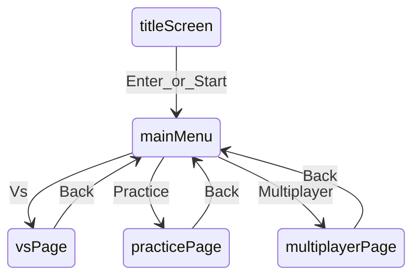
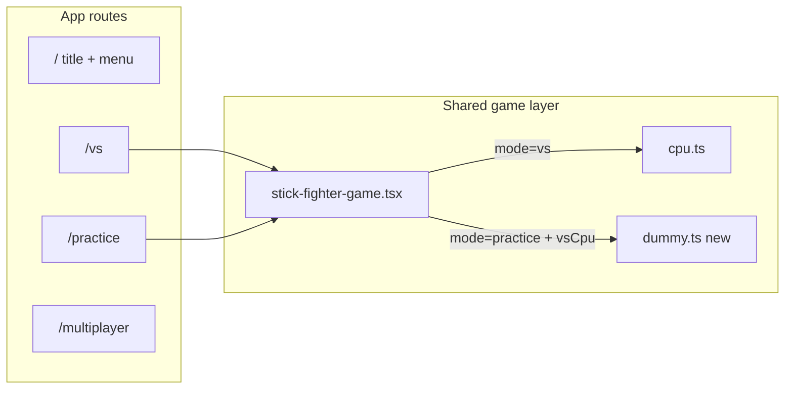

# Phase 2 — Main menu, Practice mode, and routing

## What you confirmed (grill-me)

| Decision | Choice |
|----------|--------|
| Practice round flow | **Option C** — single round to 0 HP, then auto-reset; no BO3 match score |
| Practice opponent | **Stand-still dummy** when P2 is CPU (no attacks, no movement) |
| P2 in Practice | **Keep CPU / Human toggle** — a second player can jump in on the same keyboard |
| Multiplayer (v1) | **Placeholder** — “Coming soon” page, no netcode yet |
| Routing | **Separate routes** — best fit for Vercel deploy, future auth middleware, and HTTP matchmaking lobby pages |

**Routing rationale:** Next.js App Router routes (`/vs`, `/practice`, `/multiplayer`) give you stable URLs, per-mode layouts, and a place to hang auth + polling later without refactoring a giant client-only state machine. Title + menu can stay on `/` as lightweight client components.

**Deferred from original Phase 2** (still in [`PLAN.md`](PLAN.md) but not v1): block-neutral, block-low, whiff dummies, and training HUD hints. Ship stand-still Practice first; add a `DummyBehavior` enum later when you want drill modes.

---

## User flow



| Route | Behavior |
|-------|----------|
| [`/`](src/app/page.tsx) | Title **Conflict Smasher Thirtynine Nine Ninetynine** → press Enter/Start → menu (Vs / Practice / Multiplayer) |
| [`/vs`](src/app/vs/page.tsx) | Today’s game: BO3, countdown, CPU difficulty, P2 toggle |
| [`/practice`](src/app/practice/page.tsx) | No match scoring/overlays; stand-still CPU; P2 toggle; auto-reset on round end |
| [`/multiplayer`](src/app/multiplayer/page.tsx) | Static “Coming soon” + link back |

---

## Architecture



### 1. New UI components

Create [`src/components/stick-fighter-title-screen.tsx`](src/components/stick-fighter-title-screen.tsx):
- Full-viewport centered title (exact copy: **Conflict Smasher Thirtynine Nine Ninetynine**)
- Blinking “Press Enter or Start” prompt
- `keydown` listener for `Enter` and `Space` → calls `onContinue`

Create [`src/components/stick-fighter-main-menu.tsx`](src/components/stick-fighter-main-menu.tsx):
- Three shadcn [`Button`](src/components/ui/button.tsx) links: **Vs** → `/vs`, **Practice** → `/practice`, **Multiplayer** → `/multiplayer`
- Keyboard: `1`/`2`/`3` or arrow + Enter optional nice-to-have (only if trivial)

Create [`src/components/stick-fighter-shell.tsx`](src/components/stick-fighter-shell.tsx) *(optional thin wrapper)*:
- Shared max-width layout, “Back to menu” link, mode-specific subtitle
- Used by `/vs`, `/practice`, `/multiplayer` so pages stay small

### 2. Home page rewrite

Update [`src/app/page.tsx`](src/app/page.tsx):
- Replace embedded [`StickFighterGame`](src/components/stick-fighter-game.tsx) with client wrapper: title screen → main menu (two-step state on `/`)
- Update `metadata.title` to match game name

### 3. Mode pages

Add [`src/app/vs/page.tsx`](src/app/vs/page.tsx) and [`src/app/practice/page.tsx`](src/app/practice/page.tsx):
- Each renders `<StickFighterGame mode="vs" />` or `mode="practice"`
- Practice page subtitle: “Free spar — dummy stands still. Toggle P2 to Human for couch play.”

Add [`src/app/multiplayer/page.tsx`](src/app/multiplayer/page.tsx):
- Card with short copy: online play is planned (auth + HTTP polling); link back to `/`

### 4. Stand-still dummy module

Add [`src/lib/stick-fighter/dummy.ts`](src/lib/stick-fighter/dummy.ts):

```ts
export type DummyBehavior = "standStill"; // extend later

export function computeDummyInput(): PlayerInput {
  return { move: 0, jump: false, attack: false, uppercut: false, block: false, crouch: false, cycleWeapon: false };
}
```

No state object needed for v1 (unlike [`cpu.ts`](src/lib/stick-fighter/cpu.ts)).

### 5. `StickFighterGame` mode prop

Update [`src/components/stick-fighter-game.tsx`](src/components/stick-fighter-game.tsx):

**New prop:** `mode: "vs" | "practice"` (default `"vs"` for safety).

**Input wiring** — extend `mergeCpuInput`:
- `mode === "vs"` → existing [`computeCpuInput`](src/lib/stick-fighter/cpu.ts)
- `mode === "practice" && vsCpu` → [`computeDummyInput`](src/lib/stick-fighter/dummy.ts)
- `!vsCpu` → human P2 inputs (unchanged)

**Match state machine (practice only):**
- Skip `handleRoundEnd` BO3 logic — on `game.roundOver`, call existing `resetMatch()` (or a practice-specific `resetPracticeRound()` that preserves weapons like [`createNextRoundState`](src/lib/stick-fighter/simulation.ts) if you prefer carry-over) after a short delay (~400–600ms) or immediately
- Do not set `match.phase` to `roundResult` / `countdown` / `matchEnd`
- Hide round-win score in HUD when `mode === "practice"`
- Hide CPU **Difficulty** controls when `mode === "practice"` (dummy has no difficulty)

**Vs mode:** no behavior change from today.

### 6. Future-proofing notes (no code in v1)

- Keep multiplayer placeholder copy honest: local 2P already works via P2 Human toggle; online is phase 8+
- When auth arrives, add `middleware.ts` targeting `/multiplayer` and future `/lobby/*` without touching game canvas code
- When more dummy behaviors ship, add a behavior picker on `/practice` only

---

## Files touched

| File | Change |
|------|--------|
| [`src/app/page.tsx`](src/app/page.tsx) | Title + menu landing |
| `src/app/vs/page.tsx` | New — Vs mode |
| `src/app/practice/page.tsx` | New — Practice mode |
| `src/app/multiplayer/page.tsx` | New — placeholder |
| `src/components/stick-fighter-title-screen.tsx` | New |
| `src/components/stick-fighter-main-menu.tsx` | New |
| `src/components/stick-fighter-shell.tsx` | New (shared layout) |
| `src/components/stick-fighter-game.tsx` | `mode` prop, practice auto-reset, conditional HUD |
| `src/lib/stick-fighter/dummy.ts` | New — stand-still input |
| [`PLAN.md`](PLAN.md) | Mark phase 2 partial progress; note menu + practice v1 scope |

No database, migrations, or new npm packages.

---

## How you’ll know it worked

1. Open `/` → see title → Enter → see Vs / Practice / Multiplayer menu
2. **Vs** → full BO3 match flow still works (countdown, match win, rematch)
3. **Practice** → no round/match overlays; dummy never moves or attacks; KO auto-resets fighters
4. **Practice** → flip P2 to Human → second player controls Red on same keyboard
5. **Multiplayer** → “Coming soon” page with way back
6. `npm run lint` and `npm run build` pass

---

## Verification checklist (agent)

- [ ] `npm run lint`
- [ ] `npm run build`
- [ ] Manual: title → menu → each route
- [ ] Manual: practice auto-reset after KO
- [ ] Update [`PLAN.md`](PLAN.md) **Currently active** / checkboxes / verification log
