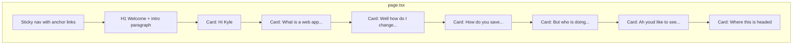

# Welcome page: markdown → `page.tsx`

## Scope

- **Single file to change:** [src/app/page.tsx](c:\Users\ryanm\dev\web-app-template\src\app\page.tsx) (full content swap). Keep it a **Server Component** (no `"use client"` unless you later add scroll-spy; anchor links + sticky nav work without client JS).
- **Source of truth for prose:** [welcome-page.md](c:\Users\ryanm\dev\web-app-template\welcome-page.md). Every sentence, list item, emphasis, and inline code string should match the markdown **character-for-character** where JSX allows (see escaping below).
- **Existing UI primitives:** Continue using [src/components/ui/card.tsx](c:\Users\ryanm\dev\web-app-template\src\components\ui\card.tsx), [src/components/ui/button.tsx](c:\Users\ryanm\dev\web-app-template\src\components\ui\button.tsx). Remove unused imports (e.g. `Separator` if no longer needed).

## Layout structure



1. **Outer wrapper:** `min-h-screen bg-background` with horizontal padding and a centered column (`mx-auto max-w-3xl` or similar — slightly wider than today’s `max-w-2xl` if long paragraphs feel cramped; tune with Tailwind only).

2. **Sticky nav:** `sticky top-0 z-50` bar with `backdrop-blur`/border per theme, containing `<a href="#slug">` links for each `##` section. Use a **horizontal scroll** row (`flex gap-2 overflow-x-auto`) so long headings like “But who is doing the work?!” don’t force ugly wraps — link **visible text should still be the exact `##` title** from the markdown (no invented shortenings).

3. **Scroll offset:** Apply `scroll-mt-24` (or match measured nav height) on each **Card** or section anchor so `href="#..."` doesn’t hide titles under the sticky bar.

4. **Hero (not a Card):** Render `# Welcome` as `<h1>` and the following paragraph exactly as in lines 3–4 of the markdown (including the em dash ` — `). Omit rendering the markdown `---` rules as visible elements; **spacing between Cards** replaces them visually while keeping all written content.

5. **Cards:** One `Card` per `##` block:
   - **`CardHeader` + `CardTitle`:** The `##` text exactly (this is the visible section title and the nav target).
   - **`CardContent`:** Everything until the next `##`, including `###` subsections, paragraphs, lists, tables, diagrams, and code blocks.
   - Typography: `CardContent` inner defaults — use Tailwind on wrappers (`space-y-4`, `leading-relaxed`, `text-muted-foreground` for body where it matches the rest of the app; bump **`h3`** for `###` to clear hierarchy, e.g. `font-heading text-base font-semibold`).

6. **Spacing:** Generous vertical rhythm: `gap-10` or `gap-12` between hero and first Card and between Cards; inside Cards use `space-y-4`/`space-y-6` for subsection blocks.

## Special markdown → JSX conversions

| Markdown feature | Implementation |
|------------------|----------------|
| `**bold**` | `<strong className="font-medium text-foreground">` or equivalent consistent with current page |
| `*italic*` | `<em>` or `italic` class |
| `` `inline` `` | `<code className="rounded-md bg-muted px-1.5 py-0.5 font-mono text-xs">` (match existing page pattern) |
| `###` headings | `<h3 id={optional}>...</h3>` — IDs optional unless you want sub-nav |
| Ordered/bullet lists | `<ol>` / `<ul>` with `list-disc`/`list-decimal` and `pl-5 space-y-2` |
| Lines 50–60 (“Ingredient table” + pipe table + arrows) | **HTML `<table>`:** caption or leading `<p>` **“Ingredient table”**; `<thead>`/`<tbody>` with columns `id`, `name`, `unit`, `costPerUnit`, `createdAt` and three data rows exactly as in markdown. Replace ASCII arrows with a small **legend row or aside**: e.g. note “← row” on row 1 and “column” under the name column — **same words as in the markdown**, arranged with Tailwind (`text-xs text-muted-foreground`, flex/grid), not a `<pre>` of the fence |
| Lines 70–80 (Browser → … flow) | **Styled vertical stack:** each row = title line + description line (exact strings), connected by a centered chevron/down-arrow icon or border — **no ASCII box**. Preserve parentheses text e.g. `(frontend)`, `(backend)` |
| `` Ctrl+` `` (line 115) | JSX: `Ctrl+{/* */}` — use `{'``'}` or unicode backtick inside curly braces to avoid template-literal confusion |
| Fence ` ``` ` with `npx prisma studio` | `<pre className="overflow-x-auto rounded-lg bg-muted p-4 font-mono text-sm"><code>…</code></pre>` |

## Tables

1. **Ingredient example:** Tailwind table pattern: `w-full border-collapse text-sm`, `th`/`td` with `border border-border px-3 py-2 text-left`, header row `bg-muted/50`. Numeric alignment optional for `id` column.

2. **Model comparison (lines 234–238):** Two columns — **“What you're doing”** and **Try first** — three body rows exactly as markdown.

## “Add an ingredient” button

- In the **“Ah, you'd like to see it work? Okay, follow me!”** Card, render **`Button asChild` + `Link` from `next/link`** to `/ingredients` (same pattern as current [src/app/page.tsx](c:\Users\ryanm\dev\web-app-template\src\app\page.tsx) lines 303–305).
- Place it **before** the paragraph that says “Scroll up to the **"Add an ingredient"** button…” so the instruction stays literally true, **or** immediately after that paragraph — prefer **before** so Kyle reads then clicks without scrolling. Button label text: **`Add an ingredient`** (matches the bold phrase in the markdown).

## Section `id` slugs (for nav + anchors)

Stable, readable IDs (must match `href`):

| Section | Suggested `id` |
|---------|------------------|
| Hi Kyle | `hi-kyle` |
| What is a web app, you ask? | `what-is-a-web-app-you-ask` |
| Well, how do I change all of this, you ask? | `well-how-do-i-change-all-of-this-you-ask` |
| How do you save your work? Oh, that's easy! | `how-do-you-save-your-work` |
| But who is doing the work?! … | `but-who-is-doing-the-work` |
| Ah, you'd like to see it work? Okay, follow me! | `ah-youd-like-to-see-it-work` |
| Where this is headed | `where-this-is-headed` |

Put `id` on the `Card` wrapper or an inner anchor-target element.

## Metadata

- Update `metadata` in `page.tsx` (title/description) to align with the new welcome copy if the old description no longer fits — **only** if needed; keep titles short and accurate.

## Verification checklist (manual)

- Diff mentally against `welcome-page.md`: every paragraph, list item, heading, table cell, and code string present.
- Click each nav link: section header visible below sticky nav.
- Ingredient + model tables are semantic `<table>`, not `<pre>`.
- Data-flow section has no raw ASCII diagram.
- `/ingredients` button works.
